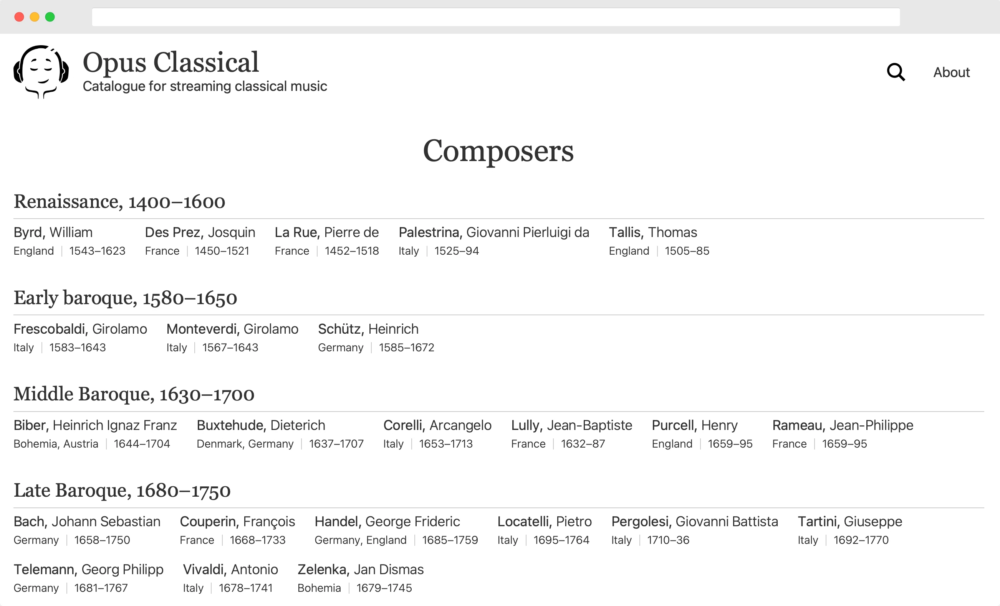

# Opus Classical

Curated catalogue of western classical music recordings.

Server side rendered website using Rust and actix-web. For client side search functionality Svelte is used with TypeScript.



## Configuration

Have config file `.env` in the root folder:

```yaml
APP_APPLICATION__PORT=8000
APP_DATABASE__HOST=localhost
APP_DATABASE__PORT=5432
APP_DATABASE__USERNAME=username
APP_DATABASE__PASSWORD=password
APP_DATABASE__DATABASE_NAME=composers
APP_DATABASE__REQUIRE_SSL=false
APP_REDIS_URI=redis://127.0.0.1:6379
APP_STATIC_ASSETS_URL=https://static.zunh.dev/composers/covers/
APP_UMAMI_ID=12345
```

## Update packages.

Have [cargo-outdated](https://github.com/kbknapp/cargo-outdated) installed.

Check outdated packages with `$ cargo outdated`.

Updated versions in `Cargo.toml`.

## Run locally natively

Have stable version of Rust installed.

Have Postgres database available and configured in `.env`.

`$ cargo run`.

Site should be available at the port configured in `.env`.

Use `$ cargo test` to run unit tests.

## Run locally in Docker

Have Docker and Docker Compose installed.

Have Postgres database available and configured in `.env`.

`$ docker compose up`.

Site should be available at the port configured in `.env`.

## Make a release

Commit to `main` branch.

Put appropriate git tag like `vX.X.X`.

Create release in GitHub.

Use docker image `ghcr.io/droidion/opusclassical:latest` (or check out available tags). 